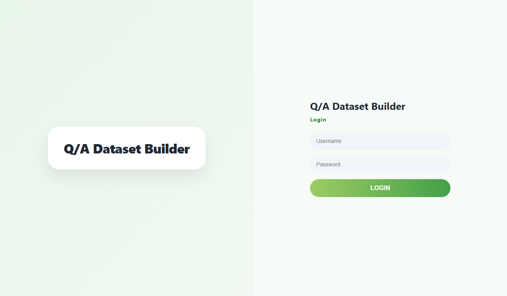

# Q/A Dataset Builder — Frontend

[](https://github.com/SASHI117/llama-dataset-frontend/actions/workflows/ci.yml)

A browser tool for **domain experts to write instruction-tuning data**. I
built it during my FarmVaidya.ai internship so that agronomists, who know the
answers but don't write JSONL, could author multi-turn question/answer
conversations for fine-tuning an agricultural assistant LLM. Each
conversation is tagged by crop and question type, and it is stored in the
`user`/`model` role format that chat templates such as Gemma's expect.



## Workflow

1. The annotator logs in and receives a bearer token, held in `sessionStorage` for that tab only.
2. They pick a **crop** (list served by the backend) and a **question type**:
   theoretical, practical, calculation, diagnostic, preventive or safety.
   Tagging by type lets the final dataset be balanced across reasoning styles
   instead of being dominated by simple factual questions.
3. They write Q/A slots and add follow-up turns for multi-turn conversations.
4. **Preview** shows exactly what will be sent, and **Submit** posts it. The
   **My Submissions** menu lists what the annotator has contributed so far.

The work is auto-saved to `localStorage` on every keystroke, so a closed tab
or dropped connection in the field doesn't lose a half-written session.

## Data contract

`POST {API}/submit`:

```json
{
  "crop": "paddy",
  "behavior": "diagnostic",
  "turns": [
    {"role": "user",  "text": "Lower leaves are yellowing from the tip…"},
    {"role": "model", "text": "This pattern usually indicates nitrogen deficiency…"},
    {"role": "user",  "text": "How much urea should I apply per acre?"},
    {"role": "model", "text": "…"}
  ]
}
```

Other endpoints used: `POST /login` → `{access_token}`, `GET /crops` →
`{crops: [...]}`, `GET /my-submissions` → `{submissions: [{crop, behavior, count, timestamp}]}`.
A `401` from any endpoint clears the session and returns to login.

## Files

| File | Purpose |
|---|---|
| `index.html` | Login page |
| `download-index.html`, `download-script.js`, `download-styles.css` | The builder |
| `config.js` | Backend base URL |

## Running

No build step. Serve the folder from its root, because the pages redirect to
`/` and `/download-index.html`:

```bash
python -m http.server 5500
```

The backend is **not part of this repository** and the hosted instance is
no longer running, so the pages load, but login needs your own API that
implements the contract above. Point `config.js` at it.

## Robustness notes

- Everything user-written (questions, answers, server data in *My
  Submissions*) is rendered with `textContent`, never `innerHTML`. Answers
  often contain `<`, `>` and units, and a preview must not execute them.
- Validation names the Q/A pair that is incomplete, and blocks submitting
  without a crop and type.
- A corrupt local draft is discarded instead of breaking the page.
- The back/forward cache is handled so that a restored page after logout
  can't be reused without logging in again.

## Limitations

- Authentication is only as strong as the backend. The frontend only
  carries the token.
- There is no reviewer or approval step in the UI. Quality control (dedup,
  expert review) happens after export.
